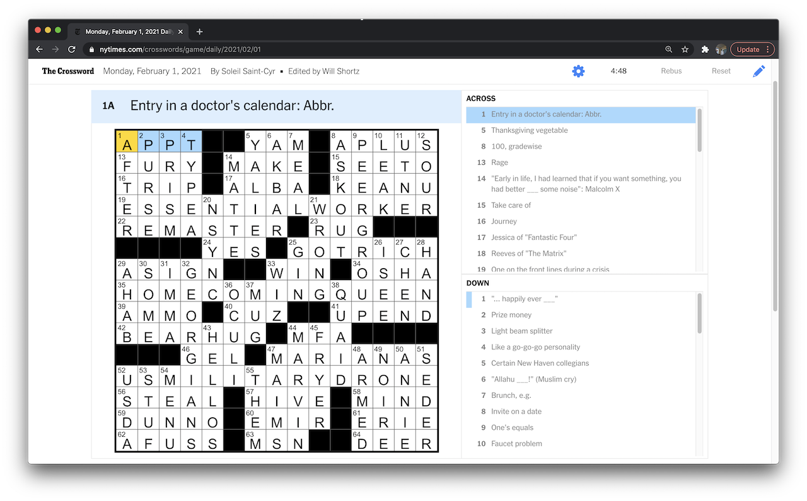
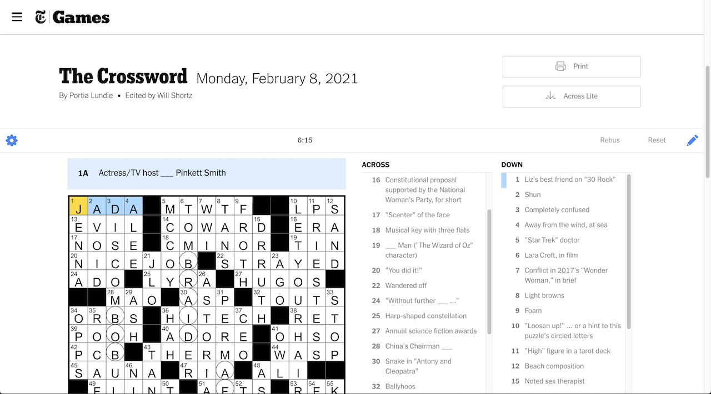

Make better use of the screen space while doing the NYTimes crossword puzzle. Inspired by the layout of AcrossLite, this Chrome extension aims to utilize viewport space more efficiently by increasing the prominence of the puzzle grid and the clues, and by reducing the real estate taken of non-puzzle items on the screen (e.g. headers, banners, puzzle title, etc). 

#### Features:
+ Remove and collapse distracting banners including ads, options, and page headers
+ Give more space to the puzzle grid, allowing it to expand with your browser
+ Collapse puzzle details such as title, date, and author in a single line, and reduce font size
+ Display the puzzle toolbar (e.g. Settings, Rebus, Reset buttons) in single line with the puzzle details
+ Re-orient the Across and Down clue boxes to be stacked instead of side-by-side (configurable via the options menu)

#### Screenshots:

##### Enabled:

##### Disabled:

#### Outstanding Items
+ Test on a puzzle with a note